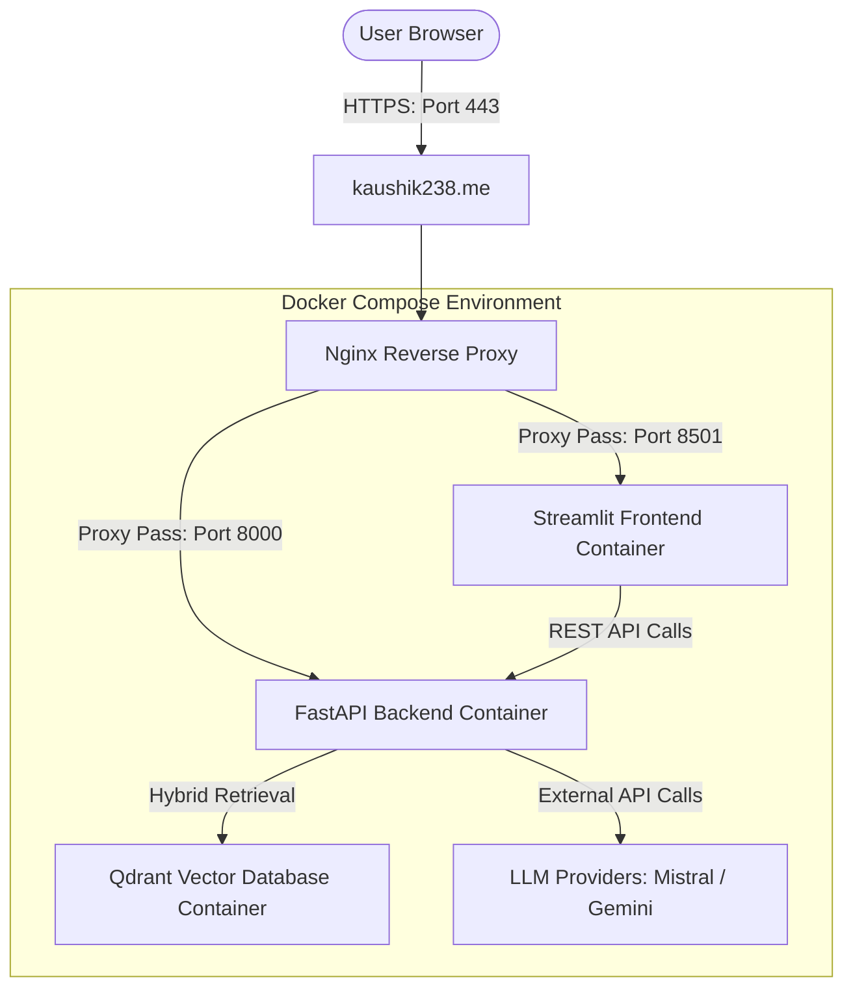
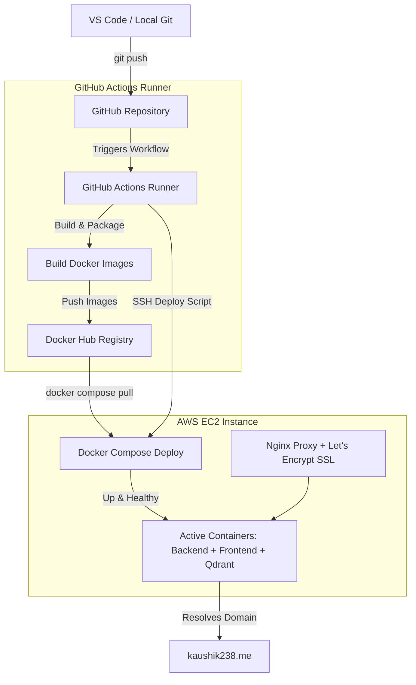
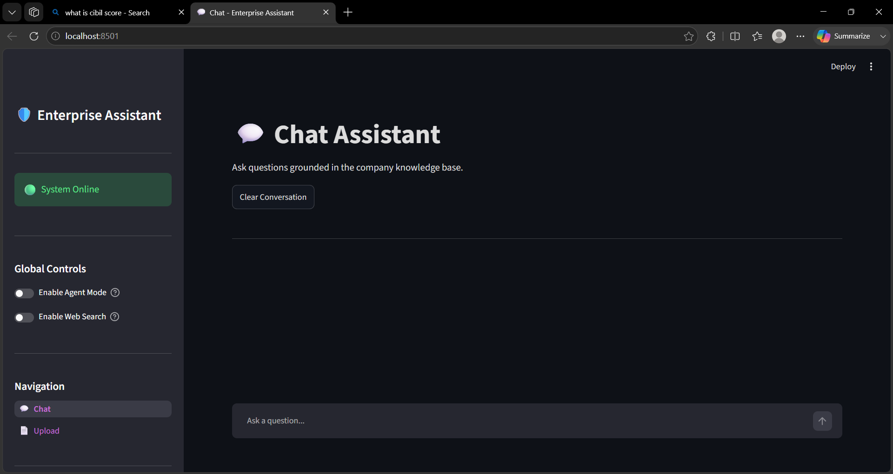
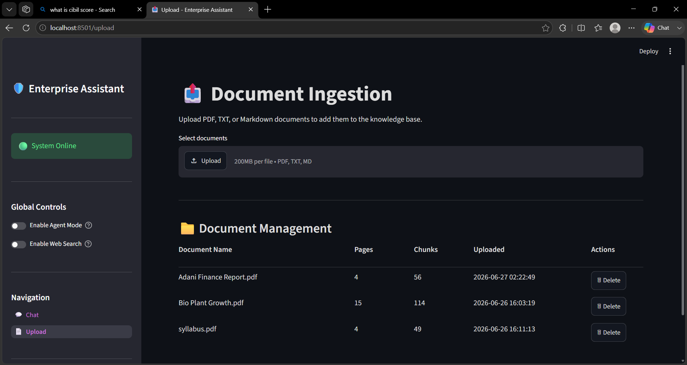
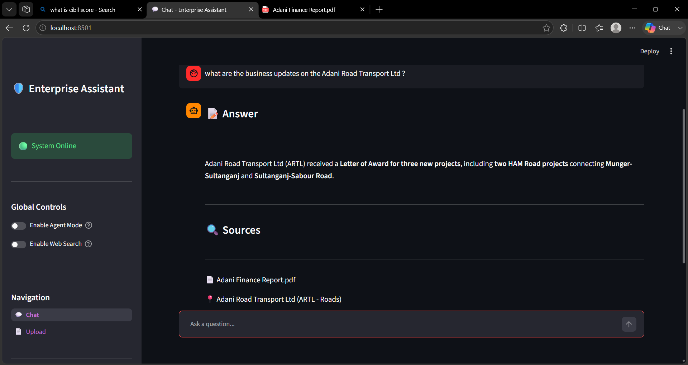
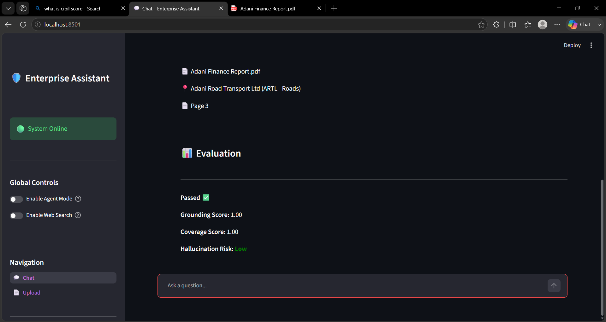
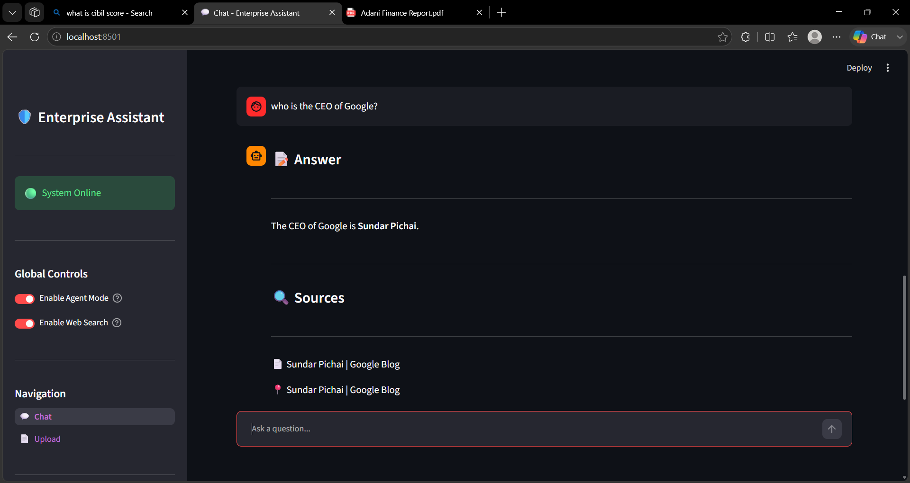

# Enterprise Knowledge Assistant (EKA)

[](https://www.python.org/)
[](https://fastapi.tiangolo.com/)
[](https://streamlit.io/)
[](https://qdrant.tech/)
[](https://www.docker.com/)
[](https://docs.docker.com/compose/)
[](https://github.com/features/actions)
[](https://aws.amazon.com/ec2/)
[](https://www.nginx.com/)
[](https://letsencrypt.org/)

The **Enterprise Knowledge Assistant (EKA)** is a production-grade, agentic Retrieval-Augmented Generation (RAG) system designed to deliver precise, grounded, and verifiable answers from complex enterprise documents (PDF, TXT, MD). Built on top of a highly optimized hybrid retrieval pipeline and modern LLM orchestration, EKA addresses the common challenges of RAG systems, including hallucination prevention, citation accuracy, multi-modal layout parsing (including tables), and retrieval sufficiency detection.

---

## 🌐 Live Demo

* **Production URL**: [https://kaushik238.me](https://kaushik238.me)
* **SSL/TLS**: HTTPS secured using Let's Encrypt
* **Infrastructure**: Hosted on AWS EC2 (Ubuntu Server)
* **Domain Management**: Custom Domain registered via Namecheap

---

## 🚀 Key Highlights

* **Hybrid Retrieval (Dense + Sparse Search)**: Combines semantic vector search (via FastEmbed) with lexical keyword matching (BM25) to capture both contextual meaning and precise terminology.
* **RRF Rank Fusion & Cross-Encoder Reranking**: Merges dense and sparse candidates using Reciprocal Rank Fusion (RRF), followed by a transformer-based Cross-Encoder reranker to surface the most relevant context.
* **Agentic Orchestration**: Uses LangGraph to implement a state-graph-based agent that dynamically routes queries between internal document search, Exa web search, or hybrid search.
* **Docling Parsing & Table Extraction**: Utilizes layout-aware PDF extraction to accurately parse structured data, tables, and document metadata.
* **Retrieval Sufficiency Detection**: Evaluates retrieval confidence against a configurable score threshold. Bypasses generation and returns a clean refusal when no relevant evidence exists, preventing stale contexts and hallucinations.
* **Claim-Based RAG Evaluation**: Runs post-generation verification by breaking answers into atomic claims and checking them against retrieved contexts for Groundedness, Query Coverage, and Hallucination Risk.
* **Deduplicated Page-Merging Citations**: Groups citations by document and page number, automatically merging overlapping chunks and keeping only high-confidence sources.
* **Modern Streamlit Interface**: Offers a clean dashboard for multi-turn chats, document uploads, and real-time visualization of evaluation metrics.

---

## 📐 Architecture Overview

The diagram below details the data flow and execution path of a user query through the EKA pipeline:

```text
                               ┌──────────────────┐
                               │   Streamlit UI   │
                               └────────┬─────────┘
                                         │ (JSON POST Request)
                                         ▼
                               ┌──────────────────┐
                               │ FastAPI Backend  │
                               └────────┬─────────┘
                                         │ (Invoke RAG)
                                         ▼
                        ┌──────────────────────────────────┐
                        │            RAGChain              │
                        └────────┬─────────────────┬───────┘
                                 │                 │
                  (Classic Mode) │                 │ (Agent Mode)
                                 ▼                 ▼
                       ┌───────────────┐   ┌───────────────┐
                       │HybridRetriever│   │  LangGraph    │
                       └──────┬────────┘   │  Orchestration│
                              │            └──────┬────────┘
                              ▼                   │ (Routes to Doc/Web/Hybrid)
               (Dense/Sparse + RRF +            ▼
                Cross-Encoder Rerank)     ┌───────────────┐
                             │            │  Search Nodes │
                             ▼            └──────┬────────┘
                      ┌───────────────┐          │
                      │  Sufficiency  │◄─────────┘
                      │  Score Check  │
                      └──────┬────────┘
                             │
            ┌────────────────┴────────────────┐
            ▼ (Sufficient)                    ▼ (Insufficient)
    ┌───────────────┐                 ┌───────────────┐
    │Context Builder│                 │Bypass Generat.│
    └──────┬────────┘                 │& Evaluation   │
           ▼                          └──────┬────────┘
    ┌───────────────┐                        │
    │LLM Generator  │                        │
    └──────┬────────┘                        │
           ▼                                 │
    ┌───────────────┐                        │
    │Claim Evaluator│                        │
    └──────┬────────┘                        │
           │                                 │
           ▼                                 ▼
    ┌─────────────────────────────────────────────────┐
    │     FastAPI Endpoint (chat.py) Citation Mapping  │
    └───────────────────────┬─────────────────────────┘
                            │ (JSON Response)
                            ▼
                     ┌───────────────┐
                     │ Streamlit UI  │
                     └───────────────┘
```

---

## 🛠️ Tech Stack

| Component | Technology | Description |
| :--- | :--- | :--- |
| **Language** | Python 3.12 | Modern, typed Python application development. |
| **Package Manager** | `uv` (by Astral) | Ultra-fast Python package resolver and environment manager. |
| **Backend Framework**| FastAPI | High-performance asynchronous REST API. |
| **Frontend Framework**| Streamlit | Clean, interactive web dashboard for chat and file upload. |
| **Orchestration** | LangChain & LangGraph | State-graph-based agentic workflows and pipeline orchestration. |
| **Vector Database** | Qdrant  | Hybrid vector storage and BM25 lexical index provider. |
| **Dense Embeddings** | FastEmbed (`BAAI/bge-small-en-v1.5`) | Fast local embedding generator (384-dimensional). |
| **Sparse Retrieval** | BM25 (`Qdrant/bm25`) | Lexical token matching. |
| **Reranking Model** | Cross-Encoder (`ms-marco-MiniLM-L-6-v2`) | Transformer-based cross-encoder for precise semantic relevance. |
| **LLM Provider** | Mistral AI (Default) / Gemini / Groq | Configurable enterprise LLM endpoints via LangChain. |
| **Parser / Ingestion** | Docling | Layout-aware document parsing, table extraction, and metadata enrichment. |

---

## 🌐 System & Deployment Topology

### Production Runtime Topology

This diagram maps out how inbound browser traffic is securely routed through the production stack:



### GitOps Continuous Deployment Pipeline

This diagram traces the deployment automation flow from code check-in to production deployment:



---

## 📂 Folder Structure

├── backend/                  # FastAPI asynchronous backend application
│   ├── agents/               # LangGraph agent workflows, tools, and routers
│   │   ├── providers/        # Direct search provider wrappers
│   │   │   ├── base.py       # Abstract web search provider base class
│   │   │   └── exa.py        # Exa search provider implementation
│   │   ├── graph.py          # State-graph compilation and node definitions
│   │   ├── nodes.py          # State machine node execution handlers
│   │   ├── router.py         # LLM-based query routing logic
│   │   ├── state.py          # LangGraph state schema definition
│   │   ├── tools.py          # Search tools exposed to agent nodes
│   │   └── web_search.py     # Web search orchestration service
│   ├── api/                  # API endpoint route controllers
│   │   ├── chat.py           # /chat endpoint mapping query evaluations and citations
│   │   ├── documents.py      # /documents endpoint handling document catalogue operations
│   │   ├── ingest.py         # /ingest endpoint for uploading and vectorizing new files
│   │   └── search.py         # /search endpoint executing retrieval diagnostics
│   ├── config/               # Application configuration and settings parsing
│   │   └── settings.py       # Pydantic Settings class for environment variable mapping
│   ├── core/                 # Shared core system utilities
│   │   └── logging.py        # Standard logging configurations
│   ├── embeddings/           # Text embedding generation models
│   │   ├── dense_embedder.py # Dense embedding generator (SentenceTransformers)
│   │   ├── hybride_embedder.py # Hybrid embedder combining dense and sparse results
│   │   ├── sparse_embedder.py # Sparse embedding generator (FastEmbed)
│   │   └── __init__.py       # Package initialization exports
│   ├── ingestion/            # Document parsing and text processing pipeline
│   │   ├── chunker.py        # Document text chunking logic
│   │   ├── metadata.py       # Document metadata extraction and schemas
│   │   ├── parser.py         # Document parsing dispatcher (Docling)
│   │   ├── pipeline.py       # Main ingestion pipeline manager
│   │   └── table_parser.py   # In-memory markdown table parsing utilities
│   ├── llm/                  # LLM invocation, answer generation, and evaluation layers
│   │   ├── evaluation.py     # Grounding, coverage, and hallucination calculator
│   │   ├── evaluator.py      # Main answer evaluator interface
│   │   ├── generator.py      # Answer generation and context builder controller
│   │   ├── model.py          # LLM client factory (Gemini, Groq, Mistral)
│   │   ├── prompts.py        # Prompts templates for generation and evaluation
│   │   └── rag_chain.py      # RAG pipeline orchestration chain
│   ├── retrieval/            # Document retrieval and reranking logic
│   │   ├── dense.py          # Qdrant dense vector search execution
│   │   ├── hybrid.py         # Hybrid search engine combining dense and sparse queries
│   │   ├── reranker.py       # Cross-Encoder model reranking module
│   │   └── retriever.py      # High-level hybrid retriever and sufficiency validator
│   ├── schemas/              # Pydantic data validation schemas
│   │   ├── chat.py           # API data models for chat requests and responses
│   │   ├── documents.py      # API data models for document management
│   │   ├── ingest.py         # API data models for document upload status
│   │   ├── search.py         # API data models for retrieval diagnostic inputs
│   │   └── __init__.py       # Package initialization exports
│   ├── services/             # Supporting domain service logic
│   │   ├── citation_service.py # Citation page-merging and validation logic
│   │   └── document_service.py # Document database registry manager
│   ├── vectorstore/          # Database client configurations
│   │   └── qdrant.py         # Qdrant client connection and schema configurations
│   └── main.py               # Backend FastAPI application entrypoint
├── frontend/                 # Interactive Streamlit frontend dashboard
│   ├── assests/              # UI stylesheets and CSS style assets
│   │   └── style.css         # Streamlit interface override stylesheet
│   ├── components/           # Streamlit UI widget components
│   │   ├── chat_message.py   # Renders markdown chat responses and citations
│   │   ├── sidebar.py        # Sidebar panel parameters and mode toggles
│   │   └── __init__.py       # Package initialization
│   ├── pages/                # Streamlit multi-page routing modules
│   │   ├── chat.py           # Chat page interface
│   │   ├── upload.py         # Document ingestion dashboard
│   │   └── __init__.py       # Package initialization
│   ├── services/             # Frontend client state managers
│   │   ├── api.py            # API request controller (communicates with FastAPI)
│   │   ├── state.py          # Streamlit UI session state properties manager
│   │   └── __init__.py       # Package initialization
│   ├── app.py                # Streamlit application main page router
│   ├── settings.py           # RAG config sliders page component
│   └── __init__.py           # Package initialization
├── .dockerignore             # Defines patterns excluded from Docker context
├── .env.example              # Environment configuration secrets file
├── .gitignore                # Specifies untracked files to ignore in Git
├── .python-version           # Declares Python version constraints
├── docker-compose.yml        # Production Docker container coordinator
├── Dockerfile.backend        # Production multi-stage Docker build file
├── main.py                   # Stub entrypoint script
├── pyproject.toml            # Package dependency manifest (managed via uv)
├── README.md                 # Complete system documentation
├── start.sh                  # Application startup script daemon
└── uv.lock                   # Deterministic package dependency lockfile

---

## ✨ Features Detail

| Feature | Technical Implementation |
| :--- | :--- |
| **Hybrid Retrieval** | Combines Dense vector embeddings (BGE-small) and lexical BM25 scores. |
| **RRF Fusion** | Merges Dense and Sparse rank positions using Reciprocal Rank Fusion (RRF) to leverage both semantic and exact-match capabilities. |
| **Cross-Encoder Reranking** | Re-scores candidates using a MS-MARCO Cross-Encoder model to bubble up the most contextually relevant chunks. |
| **LangGraph Agent Mode** | Executes an agentic state graph that routes between document search, Exa web search, and hybrid search based on query type. |
| **Table Extraction** | Docling parses tables from complex enterprise PDFs and represents them cleanly as Markdown for accurate LLM extraction. |
| **Retrieval Sufficiency** | Validates top reranker score against a minimum threshold (`0.35`). Triggers immediate clean refusal if evidence is insufficient. |
| **Claim-Based Evaluation** | Extracts atomic claims from the generated answer and verifies them against context using LLM reasoning (Groundedness, Coverage, and Hallucination Risk). |
| **Page-Merging Citations** | Automatically merges citations originating from the same page, keeping the chunk with the highest similarity score. |
| **Document Management** | Exposes REST APIs to list, upload, parse, and delete documents with real-time Qdrant index updates. |

---

## 🔍 Retrieval Pipeline

EKA implements a state-of-the-art multi-stage retrieval pipeline:

```text
Query ──┬──> Dense Search (FastEmbed BGE-small) ──> Top 20 Candidates ──┐
        └──> Sparse Search (BM25 Lexical) ───────> Top 20 Candidates ──┼──> RRF Fusion (Top 50 Chunks) ──> Cross-Encoder Reranking (Top 5 Chunks) ──> Context Builder
```

1. **Dense Retrieval**: Generates vector embeddings for the query and extracts the top 20 nearest chunks from the Qdrant dense vector index using cosine similarity.
2. **Sparse Retrieval**: Executes keyword-based token matching (BM25) on the Qdrant document collection to capture precise terminology and numbers, returning the top 20 candidates.
3. **Reciprocal Rank Fusion (RRF)**: Merges rank positions from the dense and sparse candidate pools. Candidates are scored based on:
   $$\text{RRF Score}(d) = \sum_{m \in M} \frac{w_m}{k + \text{rank}_m(d)}$$
   This bubbles up chunks that score consistently well in both semantic and token matching.
4. **Cross-Encoder Reranking**: The top 50 candidates are fed into `ms-marco-MiniLM-L-6-v2`. This model evaluates the query-chunk pairs simultaneously, producing highly accurate relevance scores.
5. **Context Building**: Chunks scoring above the retrieval threshold are passed to the Context Builder, which resolves duplicates, merges adjacent chunks from the same page, and structures the text and tables under budget limits.
6. **Answer Generation**: The structured context and query are passed to the configured LLM (e.g., Mistral AI) to generate a concise, grounded answer.
7. **Claim-Based Evaluation**: The generated answer is validated post-hoc to verify factual correctness and calculate precision metrics.

---

## 🤖 Agentic Workflow

When **Agent Mode** is enabled, EKA executes a stateful graph built using **LangGraph**:

```text
               ┌───────────────┐
               │  Query Router │
               └───────┬───────┘
                       │
        ┌──────────────┼──────────────┐
        ▼              ▼              ▼
 ┌────────────┐ ┌────────────┐ ┌────────────┐
 │ Documents  │ │ Web Search │ │   Hybrid   │
 │   Search   │ │ (Exa API)  │ │   Search   │
 └──────┬─────┘ └──────┬─────┘ └──────┬─────┘
        │              │              │
        └──────────────┼──────────────┘
                       ▼
            ┌─────────────────────┐
            │  Answer Generation  │
            └──────────┬──────────┘
                       ▼
            ┌─────────────────────┐
            │  Answer Evaluation  │
            └─────────────────────┘
```

* **Query Router Node**: Analyzes the query using a structured LLM call and routes execution along three paths: `documents` (internal knowledge base), `web` (live web queries), or `hybrid` (cross-checking both).
* **Document Search Node**: Queries the internal Qdrant index. Sets sufficiency variables based on relevance thresholds.
* **Web Search Node**: Executes queries against the **Exa API**, fetching relevant web content.
* **Hybrid Search Node**: Triggers parallel execution of both search paths and combines the results.
* **Answer Node**: Builds the context dynamically from active search results and generates the final answer.
* **Evaluation Node**: Passes the generated answer, context, and retrieval metrics to the claim verification engine to verify safety and accuracy.

---

## 📊 Evaluation Pipeline

EKA protects against hallucinations using a strict, multi-dimensional evaluation pipeline:

```text
Answer ──> Claim Extractor ──> Atomic Claims ──> Claim Verifier (Context + Claims) ──> Supported / Unsupported ──> Metrics Calculation
```

* **Grounding Score**: The ratio of verified atomic claims to total claims:
  $$\text{Grounding Score} = \frac{\text{Supported Claims}}{\text{Total Claims}}$$
  If any claim is found to be unsupported, EKA tags the answer as containing hallucinated information.
* **Query Coverage Score**: Extracts the core information units required to satisfy the user query, and calculates how many of those units are addressed in the generated answer.
* **Hallucination Risk**: Assesses mismatch risks (e.g., entity or numerical substitutions) and flags risk levels as `Low`, `Medium`, or `High`.
* **Retrieval Sufficiency Detection**: A pre-emptive safeguard. If the top-scoring candidate fails to meet the `retrieval_min_score` (default: `0.35`), evaluations bypass metric calculations, set status to `INSUFFICIENT_EVIDENCE`, and return a standard refusal answer with zero sources attached.

---

## 🛠️ DevOps & Infrastructure Setup

The EKA platform is designed to be highly portable and ready for cloud deployment. The infrastructure stack consists of:

* **Docker & Docker Compose**: The backend, frontend, and vector database are containerized, ensuring consistent environments across local machines and production servers.
* **Nginx Reverse Proxy**: Acts as a gateway, routing traffic to backend and frontend containers, offloading SSL decryption, and providing Gzip compression.
* **Let's Encrypt**: Secures client connections with automated TLS certificate renewals.
* **Continuous Integration & Continuous Deployment (CI/CD)**: Handled by GitHub Actions to compile, test, build, and deploy changes on EC2 instances automatically.
* **Liveness & Readiness Probing**: FastAPI exposes a `/health` endpoint that is polled by Nginx and Docker to monitor container health status.

---

## 🚀 Deployment Instructions

Follow these instructions to deploy EKA to a production server (Ubuntu on AWS EC2):

### 1. Build and Publish Docker Images
Define your registry configurations (e.g., Docker Hub) and build the backend image:
```bash
docker build -t kaushik238p/eka-backend:latest -f Dockerfile.backend .
docker push kaushik238p/eka-backend:latest
```

### 2. Configure `docker-compose.yml` on your VM
Copy the project’s `docker-compose.yml` file to the EC2 host and configure the environment:
```yaml
version: '3.8'

services:
  eka:
    image: kaushik238p/enterprise-knowledge-assistant:latest
    container_name: eka
    restart: unless-stopped
    ports:
      - "8000:8000"
      - "8501:8501"
    env_file:
      - .env
    depends_on:
      qdrant:
        condition: service_healthy

  qdrant:
    image: qdrant/qdrant:latest
    container_name: qdrant
    restart: unless-stopped
    ports:
      - "6333:6333"
    volumes:
      - qdrant_storage:/qdrant/storage
    healthcheck:
      test: ["CMD", "curl", "-f", "http://localhost:6333/health"]
      interval: 10s
      timeout: 5s
      retries: 3

volumes:
  qdrant_storage:
```

### 3. Spin Up the Service Containers
Start all services in detached mode:
```bash
docker compose up -d
```

### 4. Configure Nginx Reverse Proxy
Install Nginx and add a virtual host configuration:
```bash
sudo apt update && sudo apt install -y nginx
sudo nano /etc/nginx/sites-available/eka
```
Insert the reverse proxy mapping configuration:
```nginx
server {
    listen 80;
    server_name kaushik238.me;

    location / {
        proxy_pass http://localhost:8501; # Streamlit Port
        proxy_http_version 1.1;
        proxy_set_header Upgrade $http_upgrade;
        proxy_set_header Connection "upgrade";
        proxy_set_header Host $host;
    }

    location /api {
        proxy_pass http://localhost:8000/; # FastAPI Port
        proxy_set_header Host $host;
        proxy_set_header X-Real-IP $remote_addr;
    }
}
```
Link the site and reload Nginx:
```bash
sudo ln -s /etc/nginx/sites-available/eka /etc/nginx/sites-enabled/
sudo nginx -t
sudo systemctl restart nginx
```

### 5. Setup Let's Encrypt SSL/TLS Certificates
Run Certbot to fetch and configure SSL certificates:
```bash
sudo apt install -y certbot python3-certbot-nginx
sudo certbot --nginx -d kaushik238.me
```
Follow the prompts to enable HTTPS redirects.

### 6. DNS Setup (Namecheap Custom Domain)
1. Log into your Namecheap Dashboard.
2. Go to **Advanced DNS** for your custom domain (`kaushik238.me`).
3. Add an **A Record** pointing your domain name (`@`) to your AWS EC2 instance’s public Elastic IP address.

---

## 🔄 CI/CD GitOps Pipeline Flow

The GitHub Actions workflow manages continuous deployment tasks:

```text
  [ git push ]
        │
        ▼
[ GitHub Actions ] ──> Runs tests and lint checks
        │
        ▼
[ Build Docker Image ] ──> Compiles and tags production backend images
        │
        ▼
[ Push to Docker Hub ] ──> Publishes build to Docker registry
        │
        ▼
[ SSH to AWS EC2 ] ──> Connects to server to trigger deployment script
        │
        ▼
[ Pull & Restart ] ──> Runs 'docker compose pull' and 'docker compose up -d'
        │
        ▼
[ Health Probing ] ──> Validates FastAPI '/health' status
        │
        ▼
[ Deploy Success ] ──> Live updates visible at kaushik238.me
```

To configure this automation, set up these GitHub Repository Secrets:
* `DOCKER_USERNAME`: Docker Hub account name.
* `DOCKERHUB_TOKEN`: Docker Hub authentication token.
* `EC2_HOST`: Elastic IP of your EC2 virtual server.
* `EC2_SSH_KEY`: Private PEM key to log into the VM.

---

## ☁️ Cloud Infrastructure Mapping

| Infrastructure Unit | Technology Provider | Purpose |
| :--- | :--- | :--- |
| **Compute Instance** | AWS EC2(Ubuntu Server)  | Multi-core compute hosting the Docker containers. |
| **Operating System** | Ubuntu Server 26.04 LTS | Base OS layer on the VM. |
| **Static IP Address**| AWS Elastic IP | Preserves a static IP across container cycles. |
| **DNS Management** | Namecheap | Maps `kaushik238.me` to the Elastic IP. |
| **Load Balancing & SSL**| Nginx + Let's Encrypt | Offloads HTTPS certificates and manages web traffic routing. |
| **Image Registry** | Docker Hub | Stores containerized backend image releases. |
| **CI Automation** | GitHub Actions | Builds, tests, and deploys code modifications. |

---

## 🔒 Security Configuration

1. **SSL/TLS Encryption**: Inbound traffic is encrypted via TLS 1.3 certificates provisioned by Let's Encrypt.
2. **Access Control**: Production EC2 instances only accept SSH connections via key pair authentication; password authentication is disabled.
3. **Environment Isolation**: API keys (`MISTRAL_API_KEY`, `GOOGLE_API_KEY`, `EXA_API_KEY`) are managed strictly via environment variables injected at runtime, preventing hardcoded keys in repository files.
4. **Credential Secrets**: Secrets are stored within GitHub Repository Secrets to protect the CI/CD pipeline.

---

## ⚡ Performance Optimizations

* **Hybrid Retrieval Indexing**: Dense embeddings (`BAAI/bge-small-en-v1.5`) are generated locally via FastEmbed and queried against a Qdrant index.
* **BM25 Lexical Keyword Matching**: Combined with dense search using Reciprocal Rank Fusion (RRF) to ensure exact-match terms and numbers are surfaced.
* **Transformer-Based Rerankers**: Employs `ms-marco-MiniLM-L-6-v2` to rerank results, ensuring only contextually relevant documents reach the context builder.
* **Memory & Storage Footprint**:Optimized multi-stage Docker build using CPU-only dependencies to significantly reduce the production image size.

---

## ⚙️ Installation & Setup (Local Development)

### Prerequisites
* Python >= 3.12
* [uv](https://github.com/astral-sh/uv) (Astral's fast Python package installer)

### 1. Clone the Repository
```bash
git clone https://github.com/kaushik238P/enterprise-knowledge-assistant.git
cd enterprise-knowledge-assistant
```

### 2. Install Dependencies
Initialize the virtual environment and install all packages in one step using `uv`:
```bash
uv sync
```

### 3. Run the Backend
Start the FastAPI server:
```bash
uv run uvicorn backend.main:app --port 8000 --reload
```
The API documentation will be available at `http://localhost:8000/docs`.

### 4. Run the Frontend
In a new terminal, launch the Streamlit interface:
```bash
uv run streamlit run frontend/app.py
```
Open `http://localhost:8501` in your browser.

---

## 💡 Typical Usage Flow

1. **Upload Documents**: Open the **Upload** page in the Streamlit UI and upload PDF or text files. The Docling parser will structure, chunk, and index the pages.
2. **Build / Verify Index**: Monitor document listings and index states on the dashboard.
3. **Ask Questions**: Open the **Chat** interface and query the knowledge base.
4. **Interactive Evaluations**: Review inline citation links and verify evaluations (Grounding Score, Coverage, and Hallucination Risk) returned below each assistant response.
5. **Enable Agent Mode**: Toggle **Agent Mode** in the sidebar to allow dynamic routing to Exa web search for live queries.

---

## 📸 Screenshots

| Screenshot | Description |
| :--- | :--- |
| **🏠 Home Page** | Renders the primary multi-turn chat interface with sidebar parameters and prompt selection.  |
| **📤 Document Upload** | Provides document drag-and-drop uploads, listing detailed statistics on ingested pages, elements, and indexing status.  |
| **💬 Hybrid RAG Answer** | Renders assistant answers complete with inline page-level citation buttons.  |
| **📊 Evaluation Pipeline** | Displays grounding, coverage, and hallucination metrics calculated post-generation.  |
| **🤖 Agent Mode + Web Search** | Demonstrates the routing logic calling the Exa API to combine web results with document context.  |

---

## 🤝 Acknowledgements

* [FastAPI](https://fastapi.tiangolo.com/) - Modern Python web framework.
* [Streamlit](https://streamlit.io/) - Fast dashboarding app framework.
* [LangGraph](https://github.com/langchain-ai/langgraph) - Stateful agent orchestration.
* [Qdrant](https://qdrant.tech/) - High-performance hybrid vector database.
* [Docling](https://github.com/DS4SD/docling) - Advanced document parser and layouter.
* [FastEmbed](https://github.com/qdrant/fastembed) - High-speed vector embeddings generation.
* [SentenceTransformers](https://sbert.net/) - State-of-the-art embeddings and rerankers.
* [Docker](https://www.docker.com/) - Standard container runtime engine.
* [GitHub Actions](https://github.com/features/actions) - CI/CD pipeline automation framework.
* [Nginx](https://www.nginx.com/) - Reverse proxy load balancer.
* [Let's Encrypt](https://letsencrypt.org/) - Automated SSL certificate renewals.
* [AWS](https://aws.amazon.com/) - Cloud hosting infrastructure.

---
